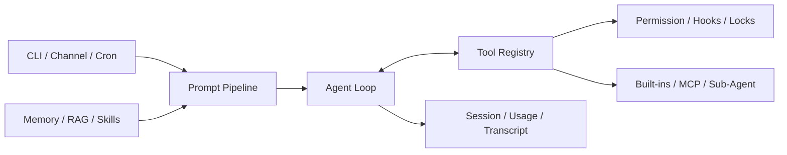

# Agent Harness

Agent Harness 是一个用 Python 编写的 Agent 架构学习项目。它不依赖 LangChain 或 LangGraph，而是直接基于 OpenAI 兼容 API，把模型调用、工具执行、上下文管理和任务调度串成一条完整的运行链路。

代码尽量把关键流程摆在明处，方便逐步阅读和改动。这是一个学习与实验项目，不是通用的生产级 Agent 平台。

## 项目主线

代码主要围绕四个问题展开：

- 多轮模型调用与工具执行如何组成 Agent Loop；
- 上下文、记忆和知识库如何控制信息量；
- 权限、预算、并发、重试和循环检测如何由程序兜底；
- 单 Agent 如何扩展到后台任务、定时任务和多 Agent 协作。

概率性的选择交给模型，可预期的边界交给程序。这是整个项目的基本分工。

## 学习路径

仓库用 tag 保留了五个递进阶段。每个阶段都建立在前一个阶段之上。

| Tag | 内容 |
| --- | --- |
| `stage-01-runtime` | 模型协议、Agent Loop、工具系统、上下文压缩、Memory 和 Session |
| `stage-02-knowledge` | Prompt Pipeline、RAG、Skills 和知识检索 |
| `stage-03-orchestration` | Todo/Task、后台任务、Cron 和 Plugin |
| `stage-04-multi-agent` | Sub-Agent、Team 协议、Worktree 和 Channel |
| `stage-05-complete` | 配置、CLI、MCP、组合根和完整测试 |

可以直接切换到某个阶段：

```bash
git checkout stage-01-runtime
```

对比相邻 tag，比一次性阅读全部代码更容易看清每个能力是为了解决什么问题。

## 整体结构



`harness/main.py` 是组合根，负责加载配置并连接各个模块。`harness/types.py` 定义内部模型协议，`harness/model.py` 适配真实的 OpenAI 兼容接口，`harness/mock_model.py` 用于无 API Key 的本地演示和测试。

## 模块概览

| 目录 | 职责 |
| --- | --- |
| `harness/agent` | 主循环、重试、输出续写和循环检测 |
| `harness/tools` | 工具注册、执行、并发控制与 MCP 接入 |
| `harness/context` | Prompt 组装、截断、摘要和上下文视图 |
| `harness/memory` / `harness/rag` | 长期记忆与本地知识检索 |
| `harness/tasks` / `harness/cron` | 任务依赖、状态持久化和定时调度 |
| `harness/agents` / `harness/teams` | Sub-Agent 调度、队友通信和协作协议 |
| `harness/security` | 角色权限、Bash 风险分类和 Hooks |
| `harness/session` / `harness/usage` | 会话恢复、Token 用量和成本记录 |

## 快速运行

需要 Python 3.11 和 [uv](https://docs.astral.sh/uv/)。

```bash
uv sync --no-editable
uv run --no-sync agent-harness init
uv run --no-sync agent-harness
```

未配置 API Key 时会使用 `MockModel`，可以直接体验主要流程。使用真实模型时，在 `agent-harness.config.json` 中保留环境变量占位符，再于 `.env` 提供对应值。

恢复最近一次会话：

```bash
uv run --no-sync agent-harness --continue
```

可选能力按需安装：

```bash
uv sync --no-editable --extra feishu
uv sync --no-editable --extra mcp
uv sync --no-editable --extra sqlite-vec
```

`--no-editable` 主要用来规避非 ASCII 项目路径下可能出现的 editable 编码问题，不是运行时的强制要求。

## 配置要点

主配置文件是 `agent-harness.config.json`。常用环境变量如下：

| 环境变量 | 用途 |
| --- | --- |
| `OPENAI_API_KEY` / `OPENAI_BASE_URL` | 模型接口 |
| `ALIYUN_API_KEY` | DashScope Embedding |
| `TAVILY_API_KEY` / `SERPER_API_KEY` | Web Search |
| `GITHUB_TOKEN` | GitHub MCP |
| `FEISHU_APP_ID` / `FEISHU_APP_SECRET` | 飞书 Channel |
| `SUPABASE_URL` / `SUPABASE_KEY` | Supabase 示例 Plugin |

没有配置真实 MCP Server 时，项目会注册 Mock GitHub MCP。配置真实 Server 后，工具由 `connect_mcp` 按需发现和加载。

不要提交 `.env`。

## 常用命令

| 命令 | 用途 |
| --- | --- |
| `/context` / `/usage` | 查看上下文和用量 |
| `/memory` / `/dream` | 查询或整理长期记忆 |
| `/rag` / `ingest <path>` | 查看或导入知识库 |
| `/skill list` / `/skill load <name>` | 管理 Skills |
| `/plugin` / `/plugin load <name>` | 管理 Plugins |
| `/agents` / `/cron` | 查看 Sub-Agent 和定时任务 |
| `/role` / `/hooks` / `/channel` | 查看安全和渠道状态 |

## 本地数据

运行期数据保存在以下目录，已在 `.gitignore` 中排除：

```text
.memory/       长期记忆
.sessions/     会话记录
.cron/         定时任务与日志
.usage/        Token 和成本记录
.tasks/        任务图
.team/         队友收件箱
.worktrees/    隔离工作区
.transcripts/  压缩前的完整会话
.task_outputs/ 较大的工具输出
knowledge.db*  可选的 SQLite 知识库
```

## 验证

```bash
uv run --no-sync ruff format --check harness tests
uv run --no-sync ruff check harness tests
uv run --no-sync pyright
uv run --no-sync pytest
```

`tests/test_curriculum.py` 覆盖跨模块主流程，包括权限审批、Hooks、Task、后台通知、Memory、MCP、Team 和 Worktree。其余测试按模块划分。
