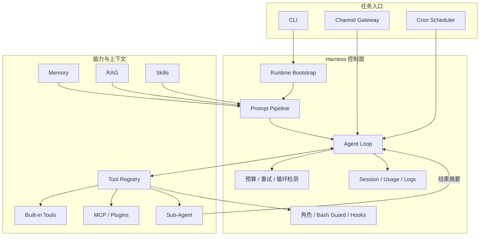

# Agent Harness

Agent Harness 是一个用 Python 实现的 AI Agent Harness 学习项目。它不依赖 LangChain 或 LangGraph，直接基于 OpenAI 兼容 API 和项目自有的模型、消息、工具协议，展示一个最小 Agent Loop 如何扩展出工具、上下文、记忆、多 Agent、安全、调度和可观测能力。

> 这是架构学习与能力验证项目，不是开箱即用的生产级通用 Agent 平台。

## 核心原则

1. 上下文是 Agent 最稀缺的资源，只在正确时间提供必要信息。
2. 概率性决策交给模型，权限、预算、并发、超时和熔断交给确定性的工程系统。
3. Harness 组件应对应明确的失败模式，不为假设中的需求增加抽象。

## 学习路径与标签

仓库按知识点逐层收紧，每个 tag 都是前一阶段的累积：

| Tag | 知识点 |
| --- | --- |
| `stage-01-runtime` | 模型协议、Agent Loop、Tool Registry、上下文压缩、Memory、Session 与 Usage |
| `stage-02-knowledge` | Prompt Pipeline、RAG、Skills 与知识检索工具 |
| `stage-03-orchestration` | Todo/Task、Cron、后台任务与 Plugin 生命周期 |
| `stage-04-multi-agent` | Sub-Agent、Team 协议、Worktree 隔离与 Channel Gateway |
| `stage-05-complete` | 配置、CLI、MCP 接入、组合根与完整闭环测试 |

例如，只学习核心运行时可以执行 `git checkout stage-01-runtime`；之后按 tag 顺序对比相邻阶段。

## 架构



## 能力矩阵

| 能力 | 实现 | 默认状态 |
| --- | --- | --- |
| Agent Loop | 真实流式输出、多步模型调用、并行工具、15 步上限、跨轮 Token 预算 | 已接入 |
| 可靠性 | 429/5xx/网络重试、Retry-After、输出续写、Reactive Compact、Fallback、循环检测 | 已接入 |
| Tool System | Registry、用户审批、角色过滤、读写锁、四阶段 Hooks、结果落盘 | 已接入 |
| Context | Prompt Pipeline、结果落盘、Snip、Microcompact、LLM 摘要、Transcript | 每轮自动执行 |
| Memory | Markdown/frontmatter、相关记忆自动加载、自动提取、BM25、Lint、Dream | 已接入 |
| RAG | Chunk、Embedding、向量/关键词混合检索、MMR | 内存默认，可配置 sqlite-vec |
| Planning | TodoWrite、Reminder、持久化任务依赖图、认领与解锁 | 已接入 |
| Multi-Agent | Parent-Child、持久队友、文件收件箱、协议、自治认领、Worktree | 已接入 |
| Background | Bash 后台执行、状态追踪、完成通知注入 | 已接入 |
| Skills | Skill 目录、模型按需加载、手动激活、Skill 根路径注入 | 已接入 |
| Code Review | `code-review-expert` Skill，默认只审查不修改 | 已接入 |
| MCP | 配置驱动的真实 stdio MCP、动态连接、名称规范化、破坏性权限 | 已接入 |
| Plugins | 生命周期、配置、动态工具、Supabase 示例 | 示例默认关闭 |
| Channel | Gateway、飞书长连接、FastAPI Dashboard | 配置后启用 |
| Cron | cron/interval/once、日志、失败自动禁用 | 已接入 |
| Session/Usage | JSONL transcript、`--continue`、成本与缓存统计 | 已接入 |

## 运行链路

```text
CLI / Channel / Cron
  -> Command Dispatcher
  -> Prompt Pipeline
  -> Agent Loop
  -> Tool Registry
  -> 权限 / Bash 检查 / Pre Hook
  -> 共享锁或独占锁
  -> Tool 执行 / 结果截断 / Post Hook
  -> 消息历史
  -> 下一步模型判断或结束
```

`harness/types.py` 定义了内部 `Model` 协议。真实模型由 `harness/model.py` 直接适配 `openai.AsyncOpenAI`；`harness/mock_model.py` 提供无需 API Key 的完整演示路径。业务模块不依赖第三方 Agent 框架。

## 目录

```text
.
├── harness/
│   ├── agent/       # 主循环、重试和循环检测
│   ├── agents/      # Sub-Agent 调度与状态
│   ├── channels/    # Channel Gateway 与飞书
│   ├── commands/    # CLI 管理命令
│   ├── config/      # Pydantic 配置模型与初始化
│   ├── context/     # Prompt、压缩、防线和视图
│   ├── cron/        # 定时任务解析、持久化和调度
│   ├── memory/      # Markdown Memory、BM25 和健康检查
│   ├── plugins/     # Plugin 生命周期与 Supabase 示例
│   ├── rag/         # Chunk、Embedding、搜索和存储
│   ├── security/    # 角色、Hooks 和 Bash 风险分类
│   ├── session/     # 会话 JSONL
│   ├── skills/      # Skill 加载器
│   ├── tools/       # 内置工具、MCP 和 Registry
│   ├── usage/       # Token、Cache 与成本
│   ├── main.py      # Composition Root
│   ├── model.py     # OpenAI 兼容适配器
│   └── mock_model.py
├── tests/
├── .skills/code-review-expert/
├── docs/
├── sample-project/
├── agent-harness.config.json
├── pyproject.toml
└── uv.lock
```

没有额外的 `agent_harness/` 包装层，也没有通用的 `src/` 层。发行包和 CLI 名称为 `agent-harness`，Python import package 使用简洁的 `harness`。

## 快速开始

环境要求：Python 3.11、[uv](https://docs.astral.sh/uv/)。

```bash
uv sync --no-editable
uv run --no-sync agent-harness init
uv run --no-sync agent-harness
```

恢复已有会话：

```bash
uv run --no-sync agent-harness --continue
```

`--no-editable` 不是运行时强制要求，但在项目绝对路径包含非 ASCII 字符、系统 locale 又不是 UTF-8 时，可以避免 editable `.pth` 的编码问题。

## 可选依赖

```bash
# 飞书 SDK
uv sync --no-editable --extra feishu

# 真实 stdio MCP Client
uv sync --no-editable --extra mcp

# sqlite-vec RAG Store
uv sync --no-editable --extra sqlite-vec
```

没有启用任何 `mcpServers` 时，运行时使用 Mock GitHub MCP，因此基础安装不需要 MCP 依赖。配置真实 Server 后，不再注册 Mock 回退；模型通过 `connect_mcp` 按需建立连接并发现工具。

## 配置

主配置为 `agent-harness.config.json`。`model.apiKey` 为空或仍是未解析的 `${ENV_NAME}` 时使用 MockModel。

```json
{
  "model": {
    "provider": "openai",
    "name": "gpt-5.6-terra",
    "baseURL": "https://api.openai.com/v1",
    "apiKey": "${OPENAI_API_KEY}"
  },
  "rag": {
    "enabled": true,
    "docsDir": "docs",
    "apiKey": "${ALIYUN_API_KEY}",
    "store": "memory",
    "databasePath": "knowledge.db"
  },
  "mcpServers": [
    {
      "name": "github",
      "enabled": true,
      "command": "github-mcp-server",
      "args": ["stdio"],
      "env": { "GITHUB_PERSONAL_ACCESS_TOKEN": "${GITHUB_TOKEN}" }
    }
  ]
}
```

Token 预算由入口持有并跨用户轮次累计，默认上限为 15000。Mock 模式下连续输入四次“测试预算”可验证第四轮超过预算后熔断。

| 环境变量 | 用途 |
| --- | --- |
| `OPENAI_API_KEY` | OpenAI 兼容模型凭据 |
| `OPENAI_BASE_URL` | 自定义 OpenAI 兼容地址 |
| `ALIYUN_API_KEY` | DashScope Embedding |
| `TAVILY_API_KEY` / `SERPER_API_KEY` | Web Search |
| `FEISHU_APP_ID` / `FEISHU_APP_SECRET` | 飞书 Channel |
| `SUPABASE_URL` / `SUPABASE_KEY` | Supabase 示例 Plugin |

不要提交 `.env`。外部 JSON 字段继续使用原有 camelCase，Python 内部使用 snake_case，Pydantic 负责兼容映射。

## Skills

Skill 放在 `.skills/<skill-name>/SKILL.md`：

```text
/skill list
/skill load code-review-expert
/code-review-expert review current changes
```

`code-review-expert` 随项目提供，包含 SOLID、删除计划、安全和代码质量检查表。加载器会把 Skill 根目录写入 Prompt，使 `references/*.md` 相对路径可解析。该 Skill 遵循 review-first：输出审查结果后，只有用户明确确认才实施修改。

## 常用命令

| 命令 | 作用 |
| --- | --- |
| `/context`、`/usage` | 查看上下文和 Token/Cache/成本 |
| `/memory`、`/memory search <query>` | 查看或搜索长期记忆 |
| `/dream` | 检查并整理记忆库 |
| `/rag`、`ingest <path>` | 查看或导入知识库 |
| `/skill list`、`/skill load <name>` | 管理 Skills |
| `/plugin`、`/plugin load <name>` | 管理 Plugins |
| `/agents` | 查看 Sub-Agent |
| `/cron` | 查看定时任务和日志 |
| `/role [owner\|collaborator\|guest]` | 查看或切换工具角色 |
| `/hooks`、`/channel` | 查看 Hooks 和渠道 |
| `sim`、`defend` | 生成测试上下文、显式查看 Context Defense 效果 |

## 本地数据兼容

迁移保留原文件格式：

```text
.memory/      # Markdown + frontmatter
.sessions/    # 每行一个 message entry 的 JSONL
.cron/        # jobs.json + logs.jsonl
.usage/       # Token 和成本 JSONL
.tasks/       # 持久化任务图
.team/        # 队友收件箱
.worktrees/   # Git worktree 与生命周期事件
.transcripts/ # 压缩前的完整会话记录
.task_outputs/ # 大工具结果落盘
knowledge.db* # 可选 SQLite Store
```

## 验证

```bash
uv run --no-sync ruff format --check harness tests
uv run --no-sync ruff check harness tests
uv run --no-sync pyright
uv run --no-sync pytest
```

课程机制的闭环测试集中在 `tests/test_curriculum.py`，覆盖权限审批、四阶段 Hook、Todo/Task、后台通知、Skill、Memory、错误恢复、MCP、团队自治和 Worktree 隔离。
