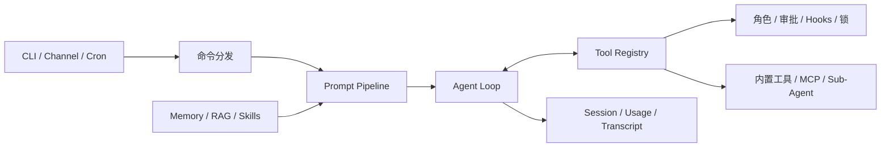

# Agent Harness

一个用 Python 实现的 Agent Harness 学习与实验项目，将 Agent Loop、工具系统、上下文、记忆和任务调度组装为一个可在本地运行的 Agent 运行时。

## 项目背景

这个项目从一个最小的 Agent Loop 开始，不依赖 LangChain 或 LangGraph。目的是把模型调用、工具执行、上下文控制和安全约束放在同一个代码库中，便于分步阅读和实验。
它是个人开发项目，用于架构学习和能力验证，不是通用的生产级 Agent 平台。

## 当前实现

- 支持流式模型输出、多步工具调用、Token 预算、重试和循环检测。
- 提供文件、Shell、本地搜索、网络搜索、Web 抓取、计算等内置工具，也可以加载 stdio MCP 工具。
- 实现 Prompt Pipeline、上下文压缩、长期记忆、RAG 和本地 Skill 加载。
- 实现 Todo/Task、后台任务、Cron 任务、Plugin 和会话/用量记录。
- 支持 Sub-Agent、持久队友、Worktree 隔离和飞书 Channel。
- 工具执行经过角色检查、Bash 风险分类、审批、Hooks 和读写锁。

## Agent 工作流程



1. CLI、Channel 或 Cron 提交用户输入。
2. Prompt Pipeline 根据当前会话加入工具说明、记忆、RAG 结果和已加载的 Skill。
3. Agent Loop 调用模型，处理文本、工具调用和工具结果。
4. Tool Registry 在执行前检查权限、风险等级、审批和并发约束，再将结果返回给 Loop。
5. 会话、用量和较大的工具输出会保存到本地目录。

## 技术栈

| 类别 | 使用内容 |
| --- | --- |
| 运行时 | Python 3.11+ 、uv |
| 模型接口 | OpenAI Python SDK、OpenAI 兼容 API |
| 配置与校验 | Pydantic、pydantic-settings、python-dotenv |
| 网络与渠道 | httpx、FastAPI、Uvicorn、可选 lark-oapi |
| 知识处理 | Beautiful Soup、markdownify、可选 sqlite-vec |
| 扩展协议 | 可选 MCP stdio Client |
| 质量检查 | pytest、Ruff、Pyright |

## 按知识点阅读

仓库有五个递进 tag：`stage-01-runtime`、`stage-02-knowledge`、`stage-03-orchestration`、`stage-04-multi-agent` 和 `stage-05-complete`。可以从 `stage-01-runtime` 开始对比阅读。

```bash
git checkout stage-01-runtime
```

### 1. 运行时与 Agent Loop

| 文件 | 对应的事 |
| --- | --- |
| `harness/__main__.py` | CLI 入口；处理 `init` 和 `--continue` 参数。 |
| `harness/main.py` | 组合根；加载配置、注册工具、启动渠道和交互循环。 |
| `harness/types.py` | 模型、消息、工具调用和用量的内部协议。 |
| `harness/model.py` / `harness/mock_model.py` | OpenAI 兼容模型适配器与无 API Key 的 MockModel。 |
| `harness/agent/loop.py` | 模型调用、多步执行、工具结果回写、Token 预算、续写和压缩恢复。 |
| `harness/agent/detection.py` / `harness/agent/retry.py` | 重复工具调用检测、可重试错误判断和退避策略。 |

### 2. 工具、安全与外部连接

| 文件 | 对应的事 |
| --- | --- |
| `harness/tools/registry.py` | 统一注册和执行工具，处理审批、并发锁、结果截断和延迟发现。 |
| `harness/tools/file_tools.py` / `search_tools.py` / `shell_tools.py` | 文件读写、本地搜索和 Shell 执行。 |
| `harness/tools/web_search.py` / `mcp.py` / `mcp_tools.py` | 网络搜索、网页抓取、Mock MCP 和真实 stdio MCP 连接。 |
| `harness/security/roles.py` / `bash_classifier.py` / `hooks.py` | 角色过滤、Bash 风险判断和四个阶段的 Hook 管线。 |

### 3. 上下文、记忆和知识检索

| 文件 | 对应的事 |
| --- | --- |
| `harness/context/prompt_builder.py` / `prompt_pipes.py` | 用 Pipe 组装 System Prompt，按需加入工具说明、记忆、RAG 和 Skill。 |
| `harness/context/compressor.py` / `defense.py` | 微压缩、摘要、工具输出截断和 TTL 修剪。 |
| `harness/memory/store.py` / `search.py` / `automation.py` | Markdown 记忆的读写、BM25 检索、自动提取和整理。 |
| `harness/rag/chunker.py` / `embedder.py` / `search.py` / `store.py` | 文档分块、Embedding、混合检索和默认内存向量库。 |
| `harness/skills/loader.py` | 发现 `.skills/<name>/SKILL.md` 并在激活后写入 Prompt。 |

### 4. 任务编排与持久化

| 文件 | 对应的事 |
| --- | --- |
| `harness/tasks/store.py` / `tools.py` / `harness/tools/todo_tools.py` | 任务依赖图、认领、解锁和当前轮次的 Todo。 |
| `harness/background/manager.py` | 跟踪后台运行的工具任务，将完成通知注入下一轮。 |
| `harness/cron/service.py` / `parser.py` / `store.py` | 解析、持久化和执行 cron、interval 和 once 任务。 |
| `harness/session/store.py` / `harness/usage/tracker.py` | JSONL 会话恢复、Token、Cache 和成本记录。 |
| `harness/plugins/manager.py` / `supabase_plugin.py` | Plugin 加载/卸载和 Supabase 示例工具。 |

### 5. 多 Agent 与交互入口

| 文件 | 对应的事 |
| --- | --- |
| `harness/agents/registry.py` / `spawn.py` | 记录 Sub-Agent 状态，检查深度和并发上限，执行子任务。 |
| `harness/teams/manager.py` / `bus.py` / `tools.py` | 持久队友、文件收件箱、计划审批和任务认领。 |
| `harness/worktrees/manager.py` / `tools.py` | 为队友创建和清理 Git Worktree。 |
| `harness/channels/gateway.py` / `feishu.py` | 统一消息渠道和可选的飞书长连接/Dashboard。 |
| `harness/commands/` | `/context`、`/memory`、`/rag`、`/skill`、`/agents` 等终端命令的调度器。 |

## 项目目录

```text
.
├── .env.example               # 环境变量模板，不含真实密钥
├── .skills/                    # 本地 Skill，例如 code-review-expert
├── docs/                       # RAG 默认导入的 Markdown 资料
├── harness/
│   ├── __main__.py            # CLI 入口
│   ├── main.py                # 运行时组装与交互主循环
│   ├── agent/                 # Agent Loop、重试和循环检测
│   ├── agents/                # Sub-Agent 调度
│   ├── background/            # 后台任务管理
│   ├── channels/              # Channel Gateway 和飞书接入
│   ├── commands/              # 终端快捷命令
│   ├── config/                # 配置模型、加载器和初始化向导
│   ├── context/               # Prompt 组装和上下文防线
│   ├── cron/                  # 定时任务
│   ├── memory/                # 长期记忆
│   ├── plugins/               # Plugin 管理与示例
│   ├── rag/                   # 文档分块、Embedding 和检索
│   ├── security/              # 角色、Hooks 和 Shell 风险检查
│   ├── session/               # 会话持久化
│   ├── skills/                # Skill 加载器
│   ├── tasks/                 # 任务图与依赖解锁
│   ├── teams/                 # 队友协作协议
│   ├── tools/                 # 内置工具、Registry 和 MCP
│   ├── usage/                 # Token 与成本统计
│   └── worktrees/             # Git Worktree 隔离
├── sample-project/             # 供代码分析实验使用的示例项目
├── tests/                      # 按模块划分的 pytest 测试
├── agent-harness.config.json   # 主配置文件
├── pyproject.toml              # 依赖、CLI 和工具配置
└── uv.lock                     # 依赖锁定文件
```

## 安装与运行

运行环境为 Python 3.11+ 和 [uv](https://docs.astral.sh/uv/)。

### 1. 克隆代码

```bash
git clone https://github.com/Evan-Lorne/agent-harness.git
cd agent-harness
```

### 2. 安装依赖

```bash
uv sync --no-editable
```

`--no-editable` 可以避免非 ASCII 项目路径下可能出现的 editable 编码问题。

如需要可选能力，分别安装对应 extra：

```bash
uv sync --no-editable --extra feishu
uv sync --no-editable --extra mcp
uv sync --no-editable --extra sqlite-vec
```

### 3. 配置环境变量

```bash
cp .env.example .env
```

在 `.env` 中填入所需的密钥。如果没有配置 `OPENAI_API_KEY`，程序会使用 `MockModel`，仍可以启动并查看命令、流程和本地能力。

### 4. 启动

```bash
uv run --no-sync agent-harness
```

第一次需要交互式生成配置时，可以运行以下命令。它会在覆盖已有 `agent-harness.config.json` 前进行确认。

```bash
uv run --no-sync agent-harness init
```

恢复最近会话：

```bash
uv run --no-sync agent-harness --continue
```

## 环境变量

环境变量模板见 [`.env.example`](.env.example)。除 `OPENAI_API_KEY` 以外，其他变量均为按需配置。

| 变量 | 用途 |
| --- | --- |
| `OPENAI_API_KEY` | OpenAI 兼容模型的 API Key |
| `OPENAI_BASE_URL` | OpenAI 兼容模型的 Base URL |
| `ALIYUN_API_KEY` | DashScope Embedding，用于 RAG |
| `TAVILY_API_KEY` / `SERPER_API_KEY` | 网络搜索工具 |
| `FEISHU_APP_ID` / `FEISHU_APP_SECRET` | 飞书 Channel |
| `SUPABASE_URL` / `SUPABASE_KEY` | Supabase 示例 Plugin |
| `GITHUB_TOKEN` | 自行在 MCP Server 配置中引用时使用 |

不要提交 `.env`。主配置文件 `agent-harness.config.json` 支持 `${ENV_VAR}` 形式的变量替换。

## 使用示例

启动后可以输入普通问题，或使用终端命令查看运行状态：

```text
You: /context
You: /rag
You: /memory
You: /agents
You: exit
```

将 Markdown 文档导入知识库：

```text
You: ingest docs/api-design.md
```

加载并使用内置代码审查 Skill：

```text
You: /skill load code-review-expert
You: /code-review-expert review current changes
```

## 当前开发状态

- 当前版本为 `1.0.0`，核心运行时、知识检索、编排和多 Agent 能力均已有实现。
- 测试位于 `tests/`，包含模块测试和 `tests/test_curriculum.py` 跨模块流程测试。
- 仓库按学习阶段保留了 `stage-01-runtime` 至 `stage-05-complete` 的 tag。

质量检查命令：

```bash
uv run --no-sync ruff format --check harness tests
uv run --no-sync ruff check harness tests
uv run --no-sync pyright
uv run --no-sync pytest
```

## 已知限制

- 项目的状态、会话、记忆和任务默认保存在本地文件系统，未提供多进程或多机协调。
- Shell 工具的安全控制是应用层的角色、审批与风险检测，不等同于操作系统级隔离。
- Supabase Plugin 是示例实现；未配置时使用 Mock 数据，配置后的真实 API 调用还未实现。
- 飞书、MCP、sqlite-vec 等集成需要额外依赖和对应的外部服务配置。

## 后续计划

当前仓库未维护独立的后续路线图。具体计划：`[待补充]`。
